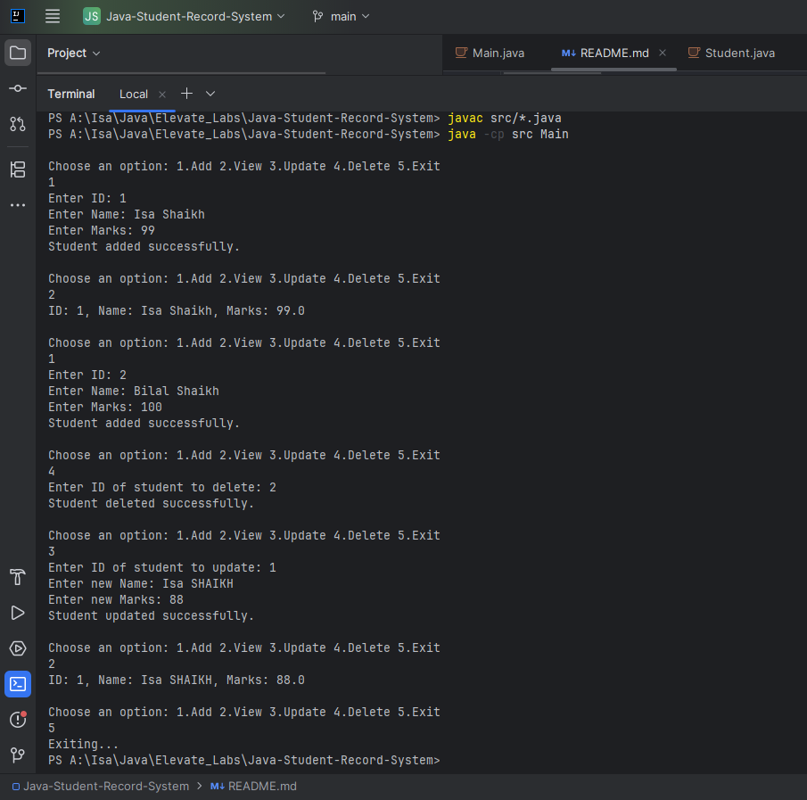

# 🗃️ Student Record Management System

A clean, efficient **CLI-based CRUD application** to manage student records using **Java** and **ArrayList**.

This project demonstrates Object-Oriented Programming concepts like **Encapsulation**, **Data Structures (ArrayList)**, and **real-world CRUD operations** — implemented with optimized code structure and minimal time complexity.

---

## ✨ Features
- ➕ Add Student Records
- 👀 View All Student Records
- ✏️ Update Existing Student Details
- ❌ Delete Student Records
- 🛡️ Encapsulated Fields (ID, Name, Marks)
- 🚀 In-Memory Storage using **ArrayList<Student>**

---

## 🗂️ Project Structure
```
Java-Student-Record-System/
├── README.md
├── .gitignore
└── src/
├── Student.java
└── Main.java
```

---

## 🚀 How to Run
1. **Compile Source Files**
    ```bash
    javac src/*.java
    ```

2. **Run the Application**
    ```bash
    java -cp src Main
    ```

---

## 📋 Sample Console Interaction
